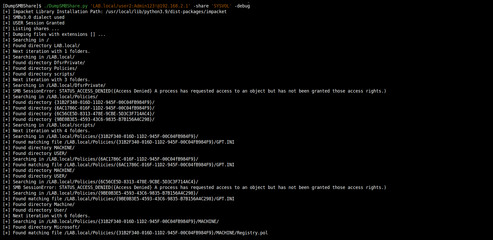

# DumpSMBShare

<p align="center">
  A script to dump files and folders remotely from a Windows SMB share.
  <br>
  
  <a href="https://twitter.com/intent/follow?screen_name=podalirius_" title="Follow"></a>
  <br>
</p>


## Features

 - [x] Only list shares with `-list-shares`.
 - [x] Select only files with given extensions (with `-extensions`) or all files.
 - [x] Choose the local folder to dump to with `-dump-dir`.
 - [x] Select base folder to search from in the share with `-base-dir`.

## Usage

```
$ ./DumpSMBShare.py -h

usage: Dump.py [-h] (-share SHARE | -list-shares) [-extensions EXTENSIONS] [-dump-dir DUMP_DIR] [-base-dir BASE_DIR] [-ts] [-debug] [-hashes LMHASH:NTHASH] [-no-pass] [-k] [-aesKey hex key] [-dc-ip ip address]
               [-target-ip ip address] [-port [destination port]]
               target

positional arguments:
  target                [[domain/]username[:password]@]<targetName or address>

optional arguments:
  -h, --help            show this help message and exit
  -share SHARE          SMB Share to dump
  -list-shares          Lists SMB shares.
  -extensions EXTENSIONS
                        Extensions
  -dump-dir DUMP_DIR    Dump directory
  -base-dir BASE_DIR    Directory to search in (Default: /)
  -ts                   Adds timestamp to every logging output
  -debug                Turn DEBUG output ON

authentication:
  -hashes LMHASH:NTHASH
                        NTLM hashes, format is LMHASH:NTHASH
  -no-pass              Don't ask for password (useful for -k)
  -k                    Use Kerberos authentication. Grabs credentials from ccache file (KRB5CCNAME) based on target parameters. If valid credentials cannot be found, it will use the ones specified in the
                        command line
  -aesKey hex key       AES key to use for Kerberos Authentication (128 or 256 bits)

connection:
  -dc-ip ip address     IP Address of the domain controller. If omitted it will use the domain part (FQDN) specified in the target parameter
  -target-ip ip address
                        IP Address of the target machine. If omitted it will use whatever was specified as target. This is useful when target is the NetBIOS name and you cannot resolve it
  -port [destination port]
                        Destination port to connect to SMB Server
```

## Example

 + Dump all files from the `SYSVOL` share:

    ```
    ./DumpSMBShare.py 'LAB.local/user2:Admin123@192.168.2.1' -debug
    ```



## Contributing

Pull requests are welcome. Feel free to open an issue if you want to add other features.
