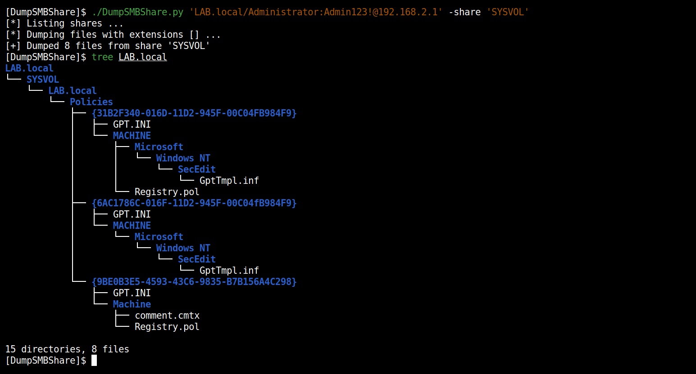

# DumpSMBShare

<p align="center">
  A script to dump files and folders remotely from a Windows SMB share.
  <br>
  
  
  <a href="https://twitter.com/intent/follow?screen_name=podalirius_" title="Follow"></a>
  <br>
</p>



## Features

 - [x] Only list shares with `-list-shares`.
 - [x] Select only files with given extensions (with `-extensions`) or all files.
 - [x] Choose the local folder to dump to with `-dump-dir`.
 - [x] Select base folder to search from in the share with `-base-dir`.

## Usage

```
$ ./DumpSMBShare.py -h
DumpSMBShare v1.2 - by @podalirius_

usage: Dump.py [-h] (-s SHARE | -l) [-e EXTENSIONS] [-D DUMP_DIR] [-f FILE] [-B BASE_DIR] [--debug] [-q] [-H LMHASH:NTHASH] [--no-pass] [-k] [-A hex key]
               [--dc-ip ip address] [-I ip address] [-P [destination port]]
               target

positional arguments:
  target                [[domain/]username[:password]@]<targetName or address>

optional arguments:
  -h, --help            show this help message and exit
  -s SHARE, --share SHARE
                        SMB Share to dump
  -l, --list-shares     Lists SMB shares.
  -e EXTENSIONS, --extensions EXTENSIONS
                        Extensions
  -D DUMP_DIR, --dump-dir DUMP_DIR
                        Dump directory
  -f FILE, --file FILE  SMB file to dump
  -B BASE_DIR, --base-dir BASE_DIR
                        Directory to search in (Default: /)
  --debug               Turn on debug output. (Default: False)
  -q, --quiet           Turn DEBUG output ON

authentication:
  -H LMHASH:NTHASH, --hashes LMHASH:NTHASH
                        NTLM hashes, format is LMHASH:NTHASH
  --no-pass             Don't ask for password (useful for -k)
  -k, --kerberos        Use Kerberos authentication. Grabs credentials from ccache file (KRB5CCNAME) based on target parameters. If valid credentials cannot
                        be found, it will use the ones specified in the command line
  -A hex key, --aesKey hex key
                        AES key to use for Kerberos Authentication (128 or 256 bits)

connection:
  --dc-ip ip address    IP Address of the domain controller. If omitted it will use the domain part (FQDN) specified in the target parameter
  -I ip address, --target-ip ip address
                        IP Address of the target machine. If omitted it will use whatever was specified as target. This is useful when target is the NetBIOS
                        name and you cannot resolve it
  -P [destination port], --port [destination port]
                        Destination port to connect to SMB Server
```

## Example

 + Dump all files from the `SYSVOL` share:

    ```
    ./DumpSMBShare.py 'LAB.local/user2:Admin123@192.168.2.1' --debug
    ```


## Contributing

Pull requests are welcome. Feel free to open an issue if you want to add other features.
